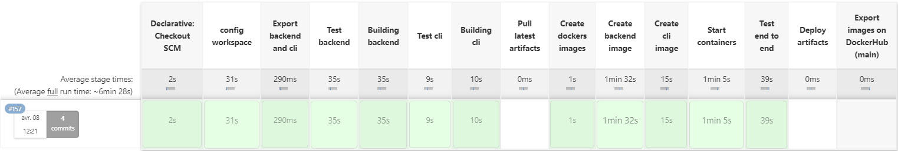
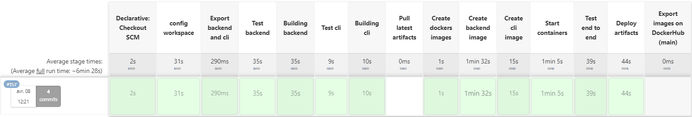

# Livraison DEVOPS

# Consigne

Vous devez documenter (et/ou automatiser via des scripts) la procédure de
construction et reconstruction.

Vous devez présenter en détail le statut de votre livrable sur l'aspect devops:
• Qu'avez vous mis en place ?
• Comment y accède-t-on (endpoint, credentials) ?
• Explicitez vos choix techniques etc

Cette documentation prendra la forme d'un markdownlivrable-devops-X.mdoù X est la
lettre de votre équipe et devra être placée dans le répertoire « doc » à la racine de votre
projet.

Ce fichier markdownpourra référencer d’autres fichiers si vous souhaitez hiérarchiser
votre documentation.

# Construction/reconstruction de l'environnement DevOps

## Prérequis:
L'environnement Devops a été configuré sur la vm vmpx08.polytech.unice.fr, la première chose à faire est donc d'y accéder et pour cela il faut se connecter au VPN (Cisco) open.unice.fr.
Il faut ensuite se connecter en ssh à la VM:
````
ssh teamh@vmpx08.polytech.unice.fr
zEBf7mD2aCHA8XG4
````
**Warning:** Tout le reste de l'installation se passe dans la VM

## Setup de l'environnement de la VM

### Docker

**Installation**
````
sudo apt-get update
sudo apt-get install \
ca-certificates \
curl \
gnupg \
lsb-release
````
**Configuration**
* Créer un groupe Docker ````sudo groupadd docker````
* Ajouter le user au groupe ````sudo usermod -aG docker $USER````
* Mettre à jour le groupe ````newgrp docker````

### Smee
Smee est utilisé pour permettre à Jenkins de recevoir des évènement de la part de GitHub.
A noter: Node.js est nécessaire pour utiliser Smee

**Installation de Node.js et smee**
````
sudo apt install npm nodejs
npm install --global smee-client
````
**Lancer Smee**
```
smee --url https://smee.io/ugXPk3XiT2ED6aZV --path /github-webhook/ --port 8001 &
````

## Création de l'environnement Docker


### Jenkins
**Installation**
* Créer un dossier `Jenkins`: `mkdir Jenkins`
* Se placer dans le dossier `Jenkins`: `cd Jenkins`
* Créer le `Dockerfile` qui va décrire notre image Docker Jenkins:
```Dockerfile
# Dockerfile of the jenkins docker-image
FROM jenkins/jenkins:jdk17-preview

USER root

# Dependencies
RUN apt-get update && apt-get install -y curl tar gzip

# Maven
RUN curl -fsSL https://dlcdn.apache.org/maven/maven-3/3.6.3/binaries/apache-maven-3.6.3-bin.tar.gz -o apache-maven-3.6.3-bin.tar.gz
RUN tar -xzf apache-maven-3.6.3-bin.tar.gz -C /opt/
ENV PATH="/opt/apache-maven-3.6.3/bin:${PATH}"

# Docker
RUN curl -fsSL https://get.docker.com -o get-docker.sh
RUN sh get-docker.sh

# Jfrig cli
RUN curl -fL https://install-cli.jfrog.io | sh
RUN chown 1000:1000 /usr/local/bin/jf
RUN mkdir /.jfrog
RUN chmod 775 /.jfrog
RUN chown 1000:1000 /.jfrog

# Python 3
RUN apt-get install -y python3

# Socat
RUN apt-get install -y socat

USER jenkins
```

* Créer le fichier `build.sh` afin de simplifier la construction de l'image Jenkins.
```sh
#!/bin/bash
docker build -t custom_jenkins .
```

*  Modifier les permission du fichier `build.sh` afin de pouvoir l'exécuter : `sudo chmod 777 build.sh`

* Créer le fichier `docker-compose.yaml`:
```yaml
version: '3.8'
services:
  jenkins:
    image: custom_jenkins
    privileged: true
    user: root
    ports:
      - 8001:8080
    container_name: jenkins
    volumes:
      - /home/teamh/jenkins/jenkins_configuration:/var/jenkins_home
      - /var/run/docker.sock:/var/run/docker.sock
```


* Construire l'image Docker Jenkins : `./build.sh`

* Lancer le container Jenkins en mode détaché `docker compose up -d`

#### Configuration de Jenkins
**Se Login sur Jenkins**
* Aller [Jenkins web page](vmpx08.polytech.unice.fr:8001)
* Se Log sur Jenkins:
Username: `admin`
Password: `348177c474054e7795cd1282d0b05c28`

**Configurer la connexion à GitHub**
* Aller sur la page de [configuration des credentials](http://vmpx08.polytech.unice.fr:8001/manage/credentials/)
* Créer un "Secret text" credential et entrer le Github token
* Créer un "Username with password" credential et entrer votre username et token Github
* Aller sur la page de [configuration du système](http://vmpx08.polytech.unice.fr:8001/configure)
* Ajouter les credentials Github et tester la connection.

**Configurer la pipeline multibranche**
* Créer un nouveau job
* Dans le champs nom mettre : `isa-devops-22-23-team-h-23`
* Selectionner "multibranch pipeline" et cliquer sur "ok".
* Sur "branch sources" ajouter "GitHub source" et selectionner les credentials associés. Ensuite coller l'url du projet: `https://github.com/pns-isa-devops/isa-devops-22-23-team-h-23.git`


### Artifactory
#### Installation
* Télécharger la version de docker compose suivante [docker-compose 7.49.6](https://releases.jfrog.io/artifactory/bintray-artifactory/org/artifactory/oss/docker/jfrog-artifactory-oss/7.49.6/jfrog-artifactory-oss-7.49.6-compose.tar.gz):
  ````
  curl -L https://releases.jfrog.io/artifactory/bintray-artifactory/org/artifactory/oss/docker/jfrog-artifactory-oss/7.49.6/jfrog-artifactory-oss-7.49.6-compose.tar.gz
  ````
* Décompresser le .tar.gz `tar xvzf jfrog-artifactory-oss-7.49.6-compose.tar.gz`
* Ouvrir le fichier `.env` et définir le `JF_ROUTER_ENTRYPOINTS_EXTERNALPORT` à `8002`
* Toujours dans le  `.env`, définir le `ROOT_DATA_DIR` à `/home/teamh/.jfrog/artifactory`
* Lancer le fichier `config.sh` en tant que root:
    ````sudo ./config.sh````
* Choisir `no` pour tout et selectionner `derby`comme db

#### Configuration
Se login sur Artifactory
* Aller sur la [page web Artifactor](vmpx08.polytech.unice.fr:8002)
* Se Log sur Artifactory:
Username: `admin`
Password: `zEzEBf7mD2aCHA8XG4!`

Configurer les dossier Artifactory:
* cliquer sur "Welcome, admin" en haut à droite sur la page d'accueil
* Cliquer sur "Quick Repository Creation"
* Cliquer sur "Maven" et suivre les étapes

# Status du livrable DevOps
## Ce qui a été mis en place
**Les grandes lignes:**
* Un repo GitHub
* Une pipeline Jenkins qui recoit les events du repo github grâce à Smee
* Artifactory qui hébergent nos livrables isa
* DockerHub qui héberge nos images Docker

### La pipeline Jenkins
Notre pipeline Jenkins a une forme différentes en fonction de la branche sur laquelle elle s'éxécute:

**Feature:**
(Pour la cli et le backend)
* Lancer les test 
* Construire les jar 
* Créer les images docker
* Lancer tout les containers (docker compose up)
* Lancer les test end to end depuis la cli


**Develop:**
(Pour la cli et le backend)
* Lancer les test 
* Construire les jar 
* Créer les images docker
* Lancer tout les containers (docker compose up)
* Lancer les test end to end depuis la cli
* Déployer les jar sur Artifactory en temps que nouvelle Snapshot


**Main:**
* Déployer les jar sur Artifactory en temps que nouvelle Release (mvn release:prepare/perform)
* Pull les derniers artefacts
* Créer des images dockers à partir de ces derniers
* Exporte ces images dockers sur DockerHub


**Note:** La création de Snapshot et Release incrémente une nouvelle version à chaque fois et créé un tag sur le repo GitHub

## Comment accéder à notre environnement
Pour accéder à notre environnement il est important de noter qu'il faut se connecter au VPN (Cisco) open.unice.fr.

#### Jenkins
Pour accéder à Jenkins il suffit de se rendre sur la page suivante:
[http://vmpx08.polytech.unice.fr:8001](http://vmpx08.polytech.unice.fr:8001)

**Identifiants:**
User: `admin`
Password: `348177c474054e7795cd1282d0b05c28`


#### Artifactory
Pour accéder à Artifactory il suffit de se rendre sur la page suivante:
[http://vmpx08.polytech.unice.fr:8002](http://vmpx08.polytech.unice.fr:8002)

**Identifiants:**
User: `admin`
Password: `zEzEBf7mD2aCHA8XG4!`

#### DockerHub
Pour accéder à notre DockerHub il suffit de se rendre sur la page suivante:
[https://hub.docker.com/r/teamh2/isa](https://hub.docker.com/r/teamh2/isa)


## Explication de nos choix techniques

#### Main
***Pourquoi sur cette branche créons et déployons nous les Releases sur Artifactory?***
La branche main est une branche stable, tout ce qui arrive sur main a déjà été testé et validé plusieurs fois. On push donc sur main assez "rarament", donc chaque push sur main corespond à une nouvelle version complètement stable du du projet. C'est donc pour ca que c'est le meilleur endroit pour créer une Release.


***Pourquoi la pipeline ne refait pas tout les tests (unitaire, intégration et end-to-end) ?***
On ne developpe pas directement main alors les seul push qui existe sur cette branche ce sont les merges de la branche develop. Cela signifie que tout le code présent sur main est parfaitement testé, c'est donc pour ca que nous avons choisit de ne pas relancer des tests.


***Pourquoi pull les artefacts sur Artifactory pour créer les images Dockers ?***
Car une release représente une nouvelle version stable, il est donc cohérent de construire nos images avec les dernières release possible.


***Pourquoi sur cette branche nous exportons les images dockers sur DockerHub?***
La branche main créé une nouvelle release à chaque build, nous crééons donc une nouvelle version des images dockers tout simplement pour les stocker. Nous pourrions imaginer dans le cadre l'intégration continus, utiliser les images dockers des Releases pour déployer automatiquement sur un serveur la dernière version de notre projet.
En se basant sur cette idée nous avons fait le choix de pas construire d'image Docker des Snapshots car nous ne déploiront pas sur notre serveur une version non-stable de notre produit.


#### Develop
***Pourquoi sur cette branche créons et déployons nous les Snapshots sur Artifactory ?***
La branche develop est une branche moins stable que la branche main mais plus à jour. Une Snapshot est une capture instantanée de l'état actuel d'un logiciel ou d'un système. La branche develop était donc la candidate idéale pour créer des Snapshots, car c'est sur cette branche qu'on intègre au reste du projet toutes les nouvelles fonctionnalités aboutis.

***Pourquoi la pipeline refait tout les tests alors qu'ils sont censés tous être passés sur la branche précédente ?***
En effet tout les tests sont censé être passé sur la branche précédente. Cependant rien ne prouve que la nouvelle fonctionnalité ne va pas rentrer en conflit avec la version actuelle de develop. Il est donc important de garder des tests sur cette branche qui n'est pas stable car de nouvelle fonctionnalités arrivent régulièrement.


***Pourquoi attendre d'avoir effectué les tests end-to-end pour déployer les jars sur Artifactory ?***
Même si les tests unitaires et d'intégrations sont passé avec succès, nous ne sommes jamais à l'abris que le tests end-to-end ne revèle une nouvelle regression. C'est pour cette raison que l'on attend d'avoir effectué les tests end-to-end pour déployer les jars sur Artifactory


#### Feature
***Pourquoi sur cette branche on ne déploie pas de jar sur Artifactory ?***
Les branches Features sont des branches non-stables, souvent en décallage avec le reste du projet il n'est pas pertinent de stocker ces versions.
